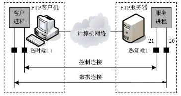
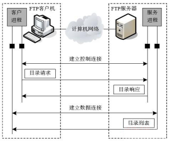
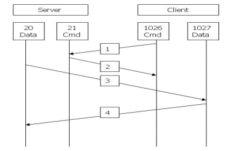
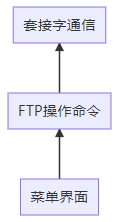
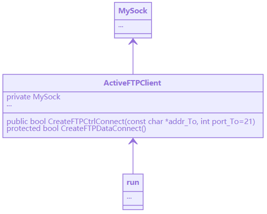
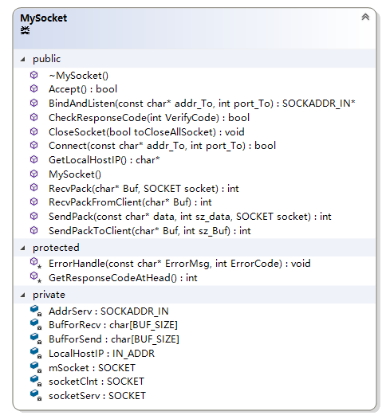
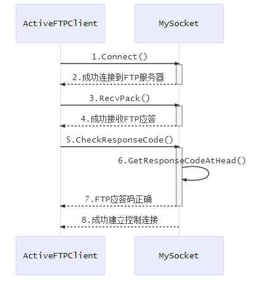
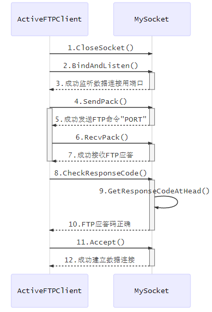

# 1.课程设计目的

​	本程序以实现一个简单易用的FTP 客户端为目标,通过分析FTP 协议的基本工作原理和FP的数据传输原理,研究如何使用C++对FTP客户端进行设计,选择C++来实现 FTP客户端程序的上传下载等主要功能。

# 2. FTP工作原理

​	FTP服务是一种有连接的文件传输服务，采用的传输层协议是TCP协议。FTP服务的基本过程是：建立连接、传输数据与释放连接。由于FTP服务的特点是数据量大、控制信息相对较少，因此在设计时采用分别对控制信息与数据进行处理的方式，这样用于通信的TCP连接也相应地分为两种类型：控制连接与数据连接。其中，控制连接用于在通信双方之间传输FTP命令与响应信息，完成连接建立、身份认证与异常处理等控制操作；数据连接用于在通信双方之间传输文件或目录信息。

|  |
| :----------------------------------------------------------: |
|                   图1 FTP服务的工作原理图                    |

​	图1给出了FTP服务的工作原理。FTP客户机向FTP服务器发送服务请求，FTP服务器接收与响应FTP客户机的请求，并向FTP客户机提供所需的文件传输服务。根据TCP协议的规定，FTP服务器使用熟知端口号来提供服务，FTP客户机使用临时端口号来发送请求。FTP协议为控制连接与数据连接规定不同的熟知端口号，为控制连接规定的熟知端口号是21，为数据连接规定的熟知端口号为20。FTP协议采用的是持续连接的通信方式，它所建立的控制连接的维持时间通常较长。

​	FTP协议规定了两种连接建立与释放的顺序。控制连接要在数据连接建立之前建立，在数据连接释放之后释放。只有建立数据连接之后才能传输数据，并在数据传输过程中要保持控制连接不中断。控制连接与数据连接的建立与释放有规定的发起者。控制连接与数据连接建立的发起者只能是FTP客户机；控制连接释放的发起者只能是FTP客户机，数据连接释放的发起者可以是FTP客户机或服务器。如果在数据连接保持的情况下控制连接中断，则可以由FTP服务器要求释放数据连接。

|    |
| :----------------------: |
| 图2  FTP服务的工作过程图 |

​	图2给出了FTP服务的工作过程。在FTP服务的工作过程中，FTP客户机向服务器请求建立控制连接，FTP客户机与服务器之间建立控制连接；FTP客户机请求登录到服务器，FTP服务器要求客户机提供用户名与密码；当FTP客户机成功登录到服务器后，FTP客户机通过控制连接向服务器发出命令，FTP服务器通过控制连接向客户机返回响应信息；当FTP客户机向服务器发出目录命令后，FTP服务器会通过控制连接返回响应信息，并通过新建立的数据连接返回目录信息。

# 3.负责部分以及设计思路

## 3.1 负责部分

​	构建底层框架，套接字网络通信的实现及封装供上层使用，实现主动模式下FTP所需的控制连接和数据连接，FTP发送命令和接收应答信息，FTP应答码的验证。

## 3.2 设计思路

​	主动方式的FTP工作过程：Port模式FTP客户端首先和FTP服务器的TCP 21端口建立连接，通过这个通道发送命令，客户端需要接收数据的时候在这个通道上发送PORT命令。PORT命令包含了客户端用什么端口接收数据。在传送数据的时候，服务器端通过自己的TCP20端口连接至客户端的指定端口发送数据。FTP server必须和客户端建立一个新的连接用来传送数据。

​	连接过程如下图3：

|  |
| :----------------------------------------: |
|         图3 FTP主动模式连接过程图          |

### 3.2.1 基本结构与类图

|  |  |
| :------------------: | :------------------: |
|   图4 程序基本结构   |      图5 类关系      |

|  |
| :--------------------------------------: |
|           图6 套接字通信工具类           |

### 3.2.2 代码分析

下面介绍我负责的类中的功能函数

​	类MySocket的功能函数见下表（注：函数参数已省略）

|         函数名          |                        功能描述                        |
| :---------------------: | :----------------------------------------------------: |
|       MySocket()        |         构造函数打开网络库并创建默认TCP套接字          |
|       ~MySocket()       |             析构函数关闭所有套接字和网络库             |
|   CheckResponseCode()   |                     验证FTP应答码                      |
| GetResponseCodeAtHead() |                 从FTP应答中获取应答码                  |
|        Connect()        |              向服务器发起连接并获取本机IP              |
|     BindAndListen()     | 为服务端套接字绑定IP和系统自动分配的端口，并返回该端口 |
|        Accept()         |                等待客户端向本机发起连接                |
|       SendPack()        |                  向某个套接字发送数据                  |
|       RecvPack()        |                  从某个套接字接收数据                  |
|   SendPackToClient()    |              向连接到本机的客户端发送数据              |
|  RecvPackFromClient()   |              从连接到本机的客户端接收数据              |
|      CloseSocket()      |                    选择性关闭套接字                    |
|    GetLocalHostIP()     |                       获取本机IP                       |
|      ErrorHandle()      |                     异常输出和处理                     |

​	类ActiveFTPClient的部分功能函数见下表（注：函数参数已省略）

|         函数名         |               功能描述                |
| :--------------------: | :-----------------------------------: |
| CreateFTPCtrlConnect() |     创建控制连接，连接到FTP服务器     |
| CreateFTPDataConnect() | 创建数据连接，监听FTP服务器连接到本机 |

### 3.2.3 主要功能实现

#### 一、创建控制连接的实现

​	`CreateFTPCtrlConnect()`建立控制连接主要由三个类`MySocket`的函数来实现，首先调用`Connet()`函数，本机作为客户端连接到FTP服务器，然后调用`RecvPack()`接收来自FTP服务器的应答信息，最后调用`CheckResponseCode()`通过验证应答码来确定是否成功连接到FTP服务器。

​	具体交互如下：

|   |
| :------------------: |
| 图7 建立控制连接交互 |

#### 二、创建数据连接的实现

​	`CreateFTPDataConnect()`建立数据连接主要由三个类`MySocket`的函数和一个类`AcitveFTPClient()`函数来实现，主动模式下，在建立数据连接时，本机作为"服务端"而FTP服务器作为“客户端”。首先调用`CloseSocket()`函数关闭可能使用过的数据连接相关套接字，然后调用`BindAndListen()`为数据连接相关套接字绑定IP和系统自动分配的端口，并使之处于监听状态，再调用`SendCommandAndRecvMessage()`发送`PORT`FTP命令告知FTP服务器本机IP和端口，最后调用`CheckResponseCode()`通过验证应答码来确定FTP服务器是否已成功接收`PORT`命令。后续调用`Accept()`真正建立数据连接。

​	具体交互如下：

|   |
| :------------------: |
| 图8 建立数据连接交互 |

# 4.本次实验感想与心得

## 4.1 遇到的难点及解决方法

​	无疑本实验最大的困难是开始时没有方向不知从哪里下手，可谓是万丈高楼开头难。又因为我负责的是搭建底层框架和封装细节供上层调用，几乎决定整个组进度。我先把教材及上课内容重新温习了一遍，在网上搜索资料过程中，我发现被动FTP是主流，主动FTP由于其局限性很少采用，我不得不先把上课例子改成主动模式来观察大体流程。接着参考了开源的被动FTP项目以模仿其层次结构以及类的设计，过程中需要大量时间和精力耐心学习和调试观察细节。

​	基本构建好框架后出现了一个致命的bug，建立数据连接accept()的阻塞问题，这导致我在其之上浪费了大半时间，严重拖垮了进度，通过多次调试不断调整其调用时机，把其与listen()分开、不连续调用，勉强修复了这个bug。后来回看教材后面，发现了更好的解决方案——使用异步模型或设置套接口选项，然而内容不熟悉和时间的不允许，只能放在本课程后学习。

## 4.2 心得与感谢

​	本次实验从选题到完成历时三周，我体会到软件开发是一个有趣而又复杂的过程。在开发的过程中遇到过许许多多的难题，有过有过气馁、沮丧甚至想到过退缩，躺在床上什么也不想干，后来在多次骂骂咧咧中直面困难，并解决了问题。

​	通过本次实验，我再一次认清“师傅领进门，修行靠个人”，整个过程中暴露了我基础不稳和面向过程的编程思想，缺乏团队合作和沟通能力，思维僵化，没有系统化规划和分析，使得在编程时走了很多弯路，吃了很多的亏。